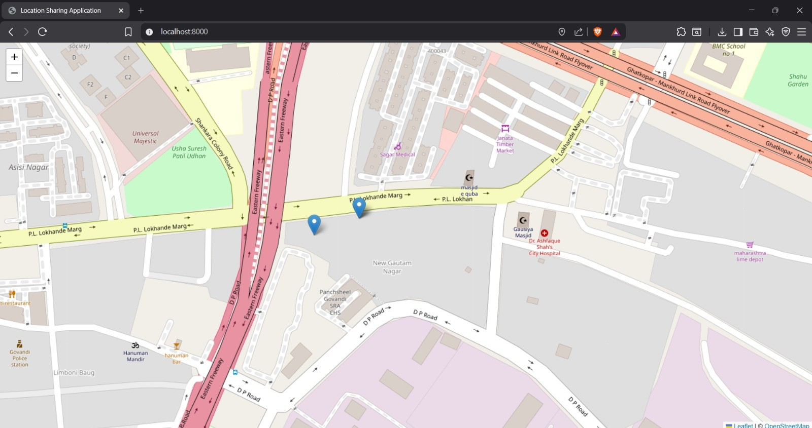

# Live Location (Kafka + Firebase)



Real-time location sharing app using Socket.IO and Kafka, with Firebase Auth for sign-in. The server broadcasts location updates through Kafka, and the frontend renders them on a Leaflet map.


## Demo Video
YouTube Link: https://youtu.be/zoC_DMOTnA4


## Tech Stack
- Node.js + Express
- Socket.IO
- Kafka (Docker)
- Firebase Auth (Email/Password)
- Leaflet

## Prerequisites
- Node.js 18+
- Docker Desktop

## Setup
1) Install dependencies
```
npm install
```

2) Start Kafka
```
docker-compose up
```

3) Create Kafka topic
```
node kafka-admin.js
```

4) Configure Firebase
- Create a Firebase project
- Enable Email/Password in Authentication
- Generate a Service Account JSON
- Set env values in .env (do not commit secrets)
- Use .env.example as a template

5) Run the server
```
node index.js
```

Open http://localhost:8000

## Environment Variables
```
PORT=8000
KAFKA_BROKER=localhost:9092
FIREBASE_API_KEY=...
FIREBASE_AUTH_DOMAIN=...
FIREBASE_PROJECT_ID=...
FIREBASE_STORAGE_BUCKET=...
FIREBASE_MESSAGING_SENDER_ID=...
FIREBASE_APP_ID=...
FIREBASE_MEASUREMENT_ID=...
FIREBASE_SERVICE_ACCOUNT={...}
```

## Socket Event Flow


## Demo Flow
- User signs up / signs in
- Browser shares location every few seconds
- Server publishes to Kafka
- Consumer broadcasts to all clients


## Kafka Consumer Groups
- Socket server runs with group `socket-server-<PORT>` and re-broadcasts updates.
- Database processor runs as a separate group `database-processor` and persists data.

## Why a Separate DB Processor
Direct database writes on every socket event would overwhelm the database at scale.
Kafka buffers events so the DB consumer can batch-write or throttle independently
from the socket broadcast path.

